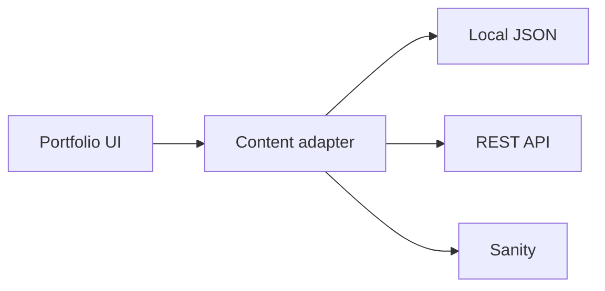
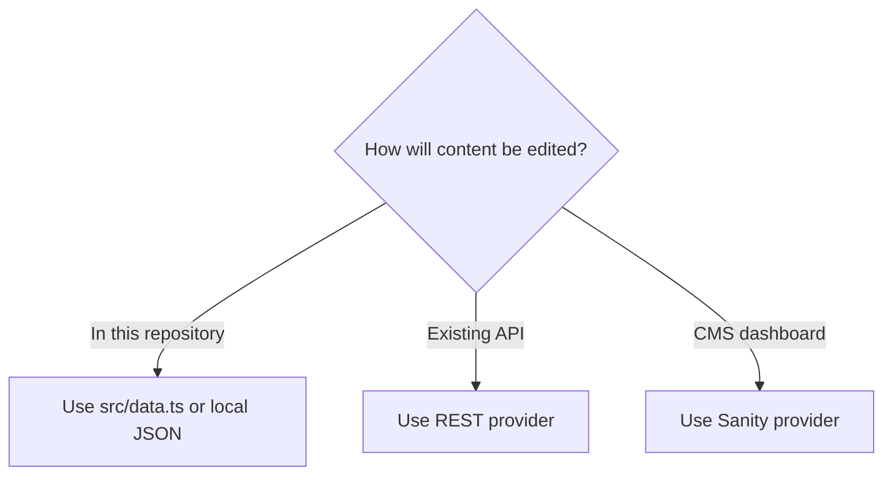

# Sidheshwar Portfolio

A reusable developer portfolio with a locked visual layer and pluggable content sources.



## Quick start

```bash
git clone https://github.com/SidheshwarSarangal/portfoionew.git
cd portfoionew
npm install
npm run dev
```

Requires Node.js 20 or newer.

## Choose your content source

| Mode | Configuration | Best for |
|---|---|---|
| Built-in | No environment variables | Fastest setup |
| Local JSON | `VITE_CONTENT_PROVIDER=local` | Static deployment |
| REST | `VITE_CONTENT_PROVIDER=rest` | Existing backend |
| Sanity | `VITE_CONTENT_PROVIDER=sanity` | No custom backend |



Copy `.env.example` to `.env.local`, then configure only the selected provider.

## Commands

| Command | Purpose |
|---|---|
| `npm run dev` | Local development |
| `npm run lint` | TypeScript validation |
| `npm run build` | Production build + SEO files |
| `npm run preview` | Preview production output |

## Documentation

| Guide | Use it for |
|---|---|
| [Documentation map](docs/README.md) | Pick the right guide |
| [Project structure](docs/PROJECT_STRUCTURE.md) | Find files quickly |
| [Content architecture](docs/CONTENT_ARCHITECTURE.md) | Understand the adapter flow |
| [Connect content/backends](docs/CONTENT_PROVIDERS.md) | Local, REST, Sanity, custom APIs |
| [SEO and analytics](docs/SEO_AND_ANALYTICS.md) | Search Console, GA4, metadata |
| [Security and performance](docs/SECURITY_AND_PERFORMANCE.md) | Headers, secrets, validation, checks |
| [Deployment](docs/DEPLOYMENT.md) | Vercel, Netlify, GitHub Pages |

## Core rule

> Content providers return data. Components control presentation.

Changing a backend must not require changing the visual components.
