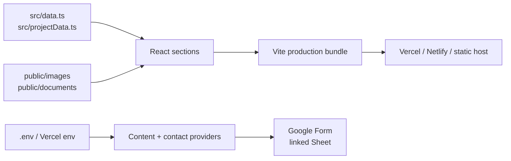
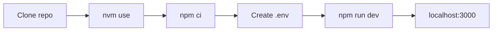
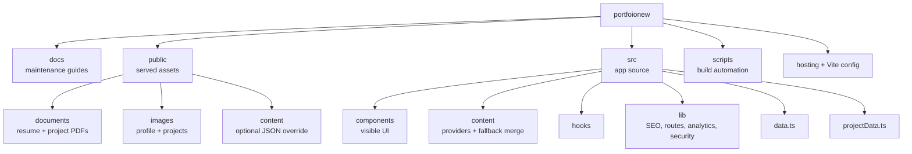
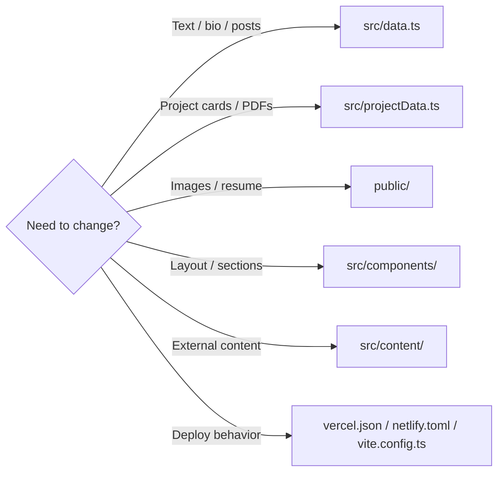
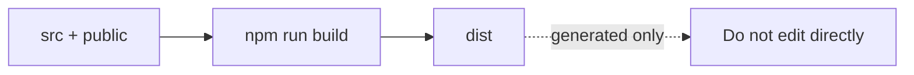
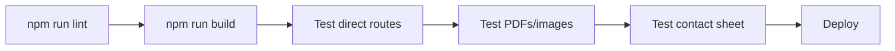

# Sidheshwar Sarangal - Portfolio

React 19 + TypeScript + Vite portfolio for projects, experience, posts, testimonials, resume downloads, and Google Forms contact capture.

Repository: [SidheshwarSarangal/portfoionew](https://github.com/SidheshwarSarangal/portfoionew)

## Project Snapshot



| Area | Source |
|---|---|
| Portfolio copy | `src/data.ts` |
| Project case studies | `src/projectData.ts` |
| Images and PDFs | `public/` |
| Contact submission | Google Forms env variables |
| SEO output | `scripts/generate-seo.mjs` |
| Hosting rules | `vercel.json`, `netlify.toml` |

## Quick Start



```bash
git clone https://github.com/SidheshwarSarangal/portfoionew.git
cd portfoionew
nvm use
npm ci
cp .env.example .env
npm run dev
```

## Commands

| Command | Does |
|---|---|
| `npm run dev` | SEO prep + Vite dev server |
| `npm run lint` | TypeScript validation |
| `npm run build` | Production `dist/` bundle |
| `npm run preview` | Preview built site |
| `npm run check` | Lint + build |

## Repository Map



## Edit Map



## Environment

Minimum local/Vercel values for the current setup:

```env
VITE_CONTENT_PROVIDER=local
VITE_GOOGLE_FORM_ACTION_URL=https://docs.google.com/forms/d/e/.../formResponse
VITE_GOOGLE_FORM_FIRST_NAME_ENTRY=entry.xxxxx
VITE_GOOGLE_FORM_LAST_NAME_ENTRY=entry.xxxxx
VITE_GOOGLE_FORM_EMAIL_ENTRY=entry.xxxxx
VITE_GOOGLE_FORM_SUBJECT_ENTRY=entry.xxxxx
VITE_GOOGLE_FORM_MESSAGE_ENTRY=entry.xxxxx
```

Optional:

| Variable | Use |
|---|---|
| `VITE_SITE_URL` | Final canonical URL; Vercel can infer preview URLs |
| `VITE_GA_MEASUREMENT_ID` | Enables GA4 |
| REST/Sanity vars | Only when using those content providers |

## Asset Rule



Use `public/` for browser-served files. Keep paths root-relative, for example `/images/projects/photos/search-platform.webp`.

## Documentation

| Guide | Best for |
|---|---|
| [Docs map](docs/README.md) | Find the right guide |
| [Project structure](docs/PROJECT_STRUCTURE.md) | Folder ownership |
| [Assets](docs/ASSETS.md) | Images, PDFs, provenance |
| [Content architecture](docs/CONTENT_ARCHITECTURE.md) | Provider and fallback flow |
| [Content providers](docs/CONTENT_PROVIDERS.md) | Local, REST, Sanity |
| [Contact form](docs/CONTACT_FORM.md) | Google Forms + Sheets |
| [SEO and analytics](docs/SEO_AND_ANALYTICS.md) | Sitemap, metadata, GA4 |
| [Security and performance](docs/SECURITY_AND_PERFORMANCE.md) | Headers, public/private values |
| [Deployment](docs/DEPLOYMENT.md) | Publish checklist |

## Release Check



```text
[ ] npm run lint
[ ] npm run build
[ ] Test project/article direct routes
[ ] Test resume and project PDF downloads
[ ] Test external links open in a new tab
[ ] Test Google Form response lands in the linked Sheet
```
