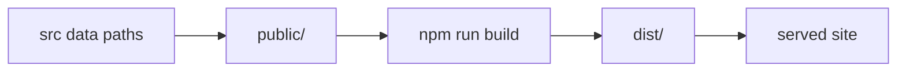
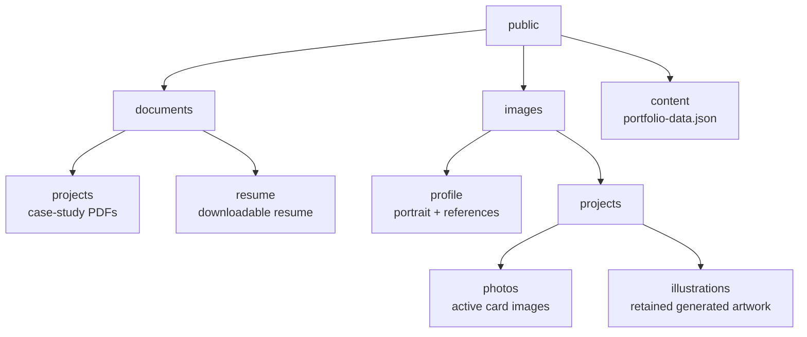
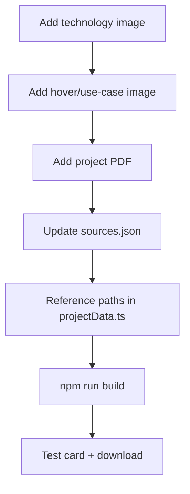
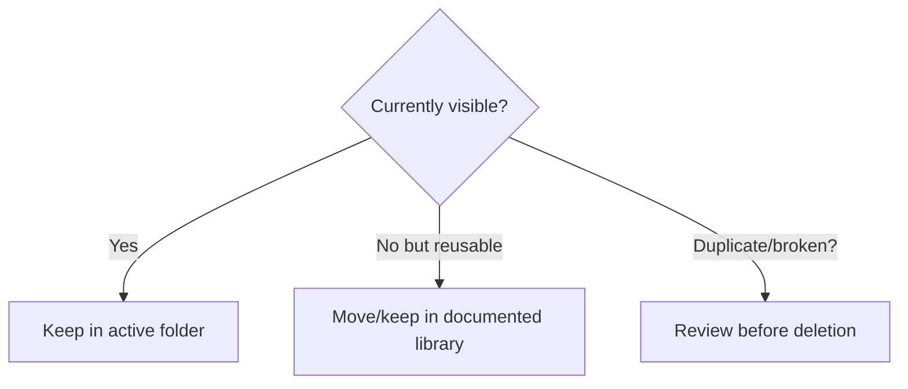

# Asset Organization

## Asset Flow



`public/` is source-controlled. `dist/` is generated.

## Folder Map



## Responsibility Matrix

| Folder | Contains | Referenced by |
|---|---|---|
| `public/documents/projects/` | Project PDFs | `src/projectData.ts` |
| `public/documents/resume/` | Resume PDF | `src/data.ts` |
| `public/images/profile/` | Portrait and profile imagery | Profile, testimonials, SEO |
| `public/images/projects/photos/` | Current project images | Project tiles |
| `public/images/projects/illustrations/` | Preserved generated artwork | Future visual reuse |
| `public/content/` | Optional JSON override | Local content provider |

## Path Rule

```mermaid
flowchart LR
  File[public/images/projects/photos/example.webp] --> Ref[/images/projects/photos/example.webp]
  Ref --> Render[resolveAssetUrl]
  Render --> Works[Root + subpath deploys]
```

Use:

```text
/images/projects/photos/search-platform.webp
/documents/projects/01_AI_Curated_Search_Engine.pdf
```

Avoid:

```text
dist/...
public/...
file://...
images with spaces in names
```

## Add Project Assets



## Preservation Rule



Do not delete useful generated artwork just because the current UI does not render it.
