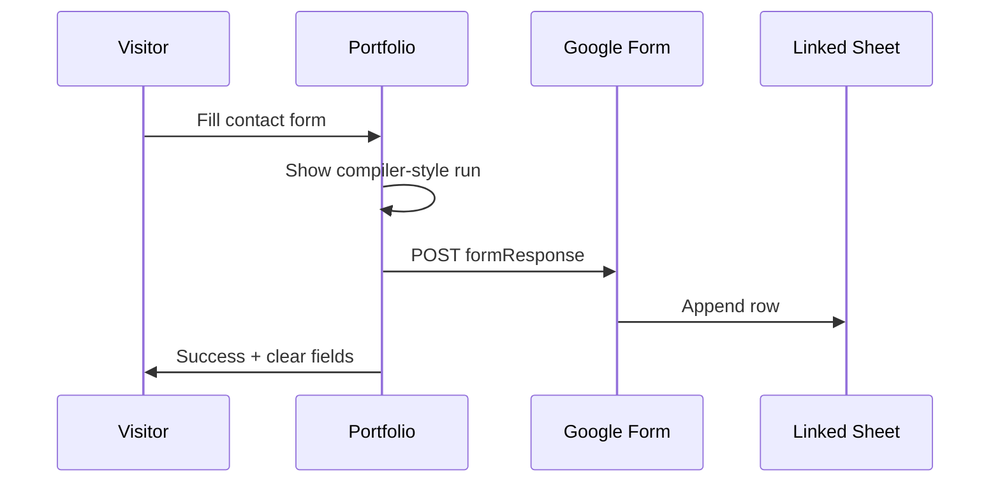
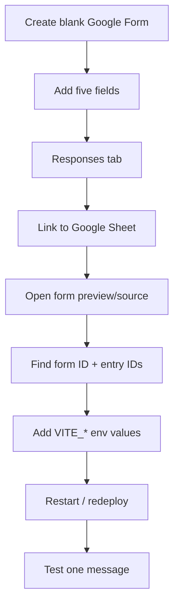
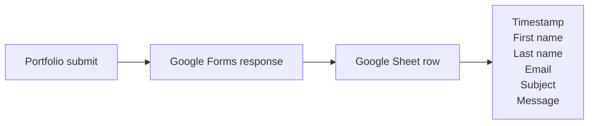

# Google Forms Contact Setup

## Contact Flow



## Form Shape

| Portfolio field | Google Form question | Type |
|---|---|---|
| `firstName` | First name | Short answer |
| `lastName` | Last name | Short answer |
| `email` | Email | Short answer |
| `subject` | Subject | Short answer |
| `message` | Message | Paragraph |

## Setup Map



## Env Values

```env
VITE_GOOGLE_FORM_ACTION_URL=https://docs.google.com/forms/d/e/YOUR_FORM_ID/formResponse
VITE_GOOGLE_FORM_FIRST_NAME_ENTRY=entry.111111111
VITE_GOOGLE_FORM_LAST_NAME_ENTRY=entry.222222222
VITE_GOOGLE_FORM_EMAIL_ENTRY=entry.333333333
VITE_GOOGLE_FORM_SUBJECT_ENTRY=entry.444444444
VITE_GOOGLE_FORM_MESSAGE_ENTRY=entry.555555555
```

For this portfolio form:

```env
VITE_GOOGLE_FORM_ACTION_URL=https://docs.google.com/forms/d/e/1FAIpQLSeA8gSRT5wx_256TFuYcDFxR2WVdOcqBPrcGBXoQjLrhDozSw/formResponse
VITE_GOOGLE_FORM_FIRST_NAME_ENTRY=entry.2097483210
VITE_GOOGLE_FORM_LAST_NAME_ENTRY=entry.164345121
VITE_GOOGLE_FORM_EMAIL_ENTRY=entry.709217032
VITE_GOOGLE_FORM_SUBJECT_ENTRY=entry.1356572923
VITE_GOOGLE_FORM_MESSAGE_ENTRY=entry.307250720
```

## Where Responses Go



## Test Checklist

```text
[ ] Add env values locally or in Vercel
[ ] Restart dev server or redeploy
[ ] Submit a full test message
[ ] Confirm compiler success screen
[ ] Confirm form clears
[ ] Confirm row appears in linked Google Sheet
```

## Notes

| Point | Meaning |
|---|---|
| Browser response | Google returns opaque `no-cors`; frontend cannot read stored result |
| Credentials | Form IDs and `entry.*` IDs are public routing values |
| Changed question | Recreated fields can change `entry.*`; update env and redeploy |
| Strong guarantees | Use a serverless endpoint if you need spam control or verified delivery |
