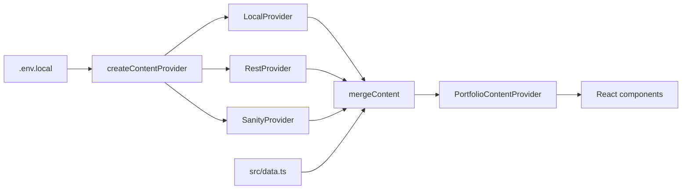
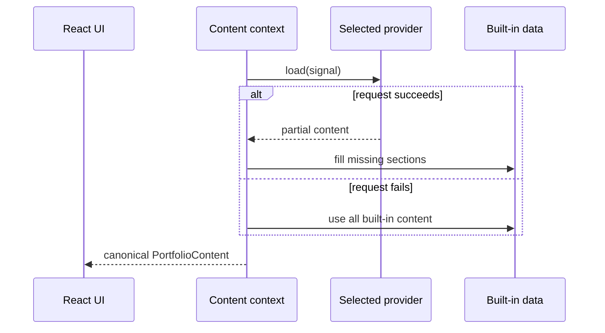
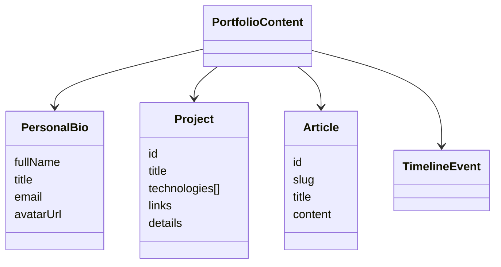
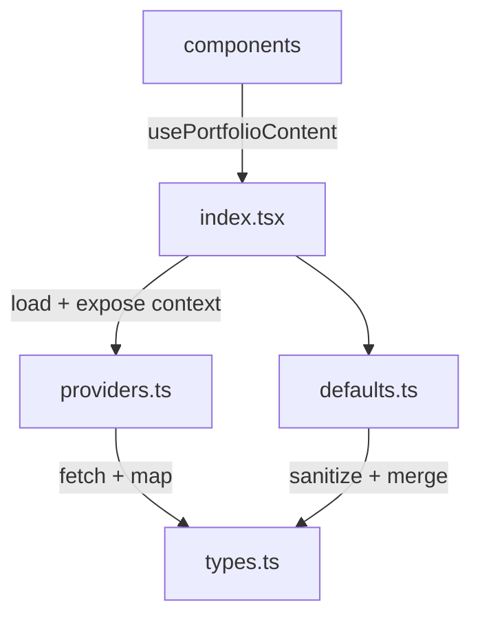
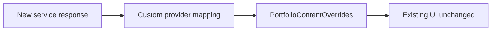

# Content Architecture

## System map



## Runtime sequence



## Canonical contract

Defined in [`src/content/types.ts`](../src/content/types.ts).

| Section | Shape | Merge rule |
|---|---|---|
| `personalBio` | Object | Field-by-field override |
| `projects` | Array | Complete replacement |
| `articles` | Array | Complete replacement |
| `timeline` | Array | Complete replacement |
| `socialLinks` | Array | Complete replacement |
| `experienceSummary` | Array | Complete replacement |
| `capabilities` | Array | Complete replacement |
| `techSkills` | Array | Complete replacement |
| `industryAwards` | Array | Complete replacement |
| `teamAwards` | Array | Complete replacement |
| `testimonials` | Array | Complete replacement |



```ts
interface ContentProvider {
  readonly name: string;
  load(signal?: AbortSignal): Promise<PortfolioContentOverrides>;
}
```

## File responsibilities



## Invariants

```text
Provider-specific mapping stays in providers.ts
Secrets never enter VITE_* variables
Components never inspect provider names
Failures always fall back to src/data.ts
Backend changes never alter the design layer
```

## Extension point



Add the provider in [`src/content/providers.ts`](../src/content/providers.ts), then register one new case in `createContentProvider()`.
