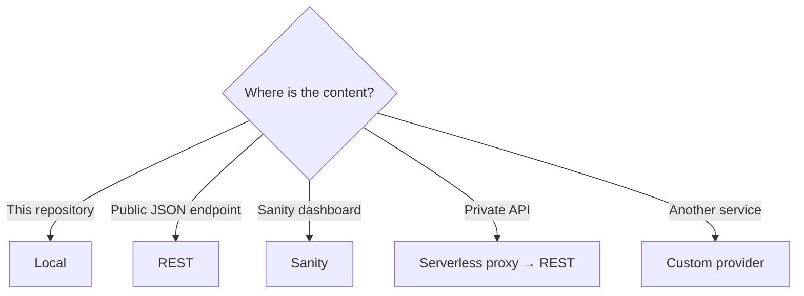
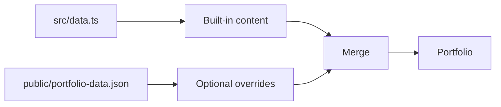
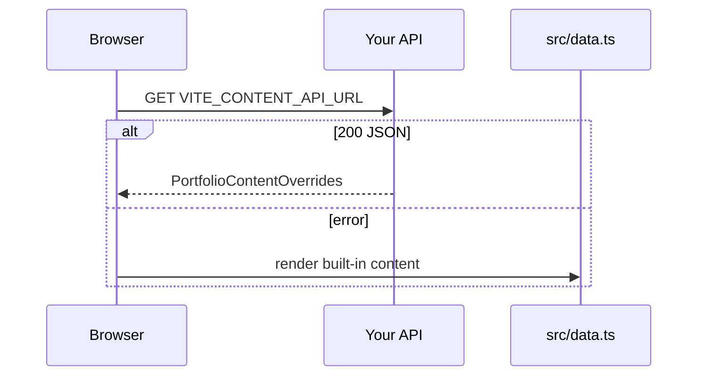
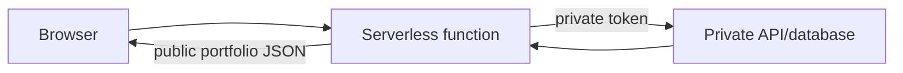
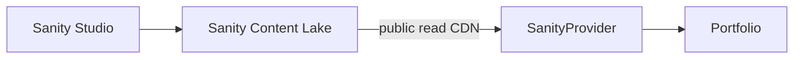
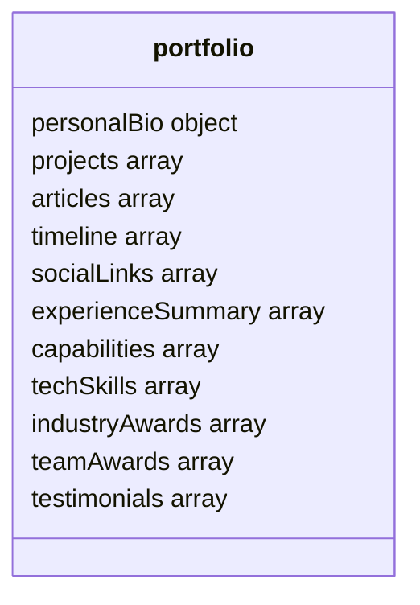
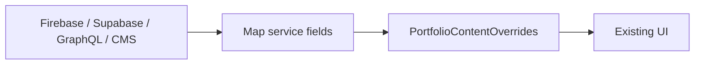
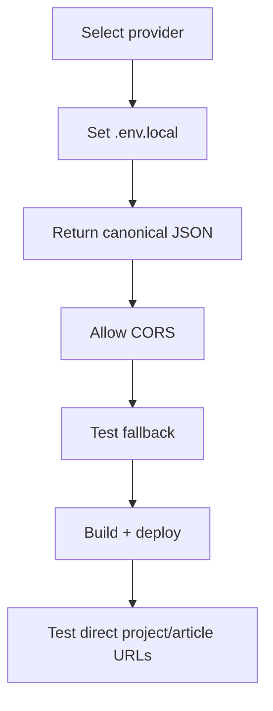

# Connect Content and Backends

## Pick a provider



Copy the environment template once:

```bash
cp .env.example .env.local
```

Restart `npm run dev` after changing `.env.local`.

---

## Option A — local content



```env
VITE_CONTENT_PROVIDER=local
```

| Task | File |
|---|---|
| Edit the complete example | `src/data.ts` |
| Override selected fields at runtime | `public/portfolio-data.json` |
| Add local images | `public/images/` |

Use image paths such as `/images/project.webp`.

---

## Option B — REST backend



### 1. Configure

```env
VITE_CONTENT_PROVIDER=rest
VITE_CONTENT_API_URL=https://api.example.com/portfolio
```

### 2. Backend requirements

| Requirement | Expected value |
|---|---|
| Method | `GET` |
| Response | `application/json` |
| CORS | Allow the portfolio origin |
| Authentication | None/private proxy only |
| Shape | `PortfolioContentOverrides` |
| Protocol | HTTPS in production |

### 3. Minimal response

```json
{
  "personalBio": {
    "fullName": "Ada Developer",
    "title": "Software Engineer"
  },
  "projects": [
    {
      "id": "search-platform",
      "title": "Search Platform",
      "category": "Backend",
      "description": "Search and indexing system.",
      "roles": ["Backend Engineering"],
      "year": "2026",
      "technologies": ["Java", "OpenSearch"],
      "accentColor": "amber",
      "imageUrl": "https://cdn.example.com/search.webp",
      "links": {
        "github": "https://github.com/user/search-platform"
      },
      "details": {
        "problem": "Users needed relevant results.",
        "solution": "Built a ranked indexing pipeline.",
        "outcomes": ["Implemented searchable document indexing"]
      },
      "featured": true
    }
  ]
}
```

Missing properties use fallback data. An included empty array intentionally removes that section's entries.

### 4. CORS example

```http
Access-Control-Allow-Origin: https://your-domain.com
Content-Type: application/json
```

### Private APIs



Point `VITE_CONTENT_API_URL` to the proxy. Never expose the private token through `VITE_*`.

---

## Option C — Sanity

No separate custom backend is required.



### Setup checklist

```text
[ ] Create a Sanity project
[ ] Create a public dataset (usually production)
[ ] Add the portfolio domain to Sanity CORS origins
[ ] Define and publish one document with _type = portfolio
[ ] Add the environment values below
[ ] Restart or redeploy the portfolio
```

```env
VITE_CONTENT_PROVIDER=sanity
VITE_SANITY_PROJECT_ID=your_project_id
VITE_SANITY_DATASET=production
VITE_SANITY_API_VERSION=2025-02-19
```

### Sanity document map



The field shapes must match [`src/content/types.ts`](../src/content/types.ts) and [`src/types.ts`](../src/types.ts).

| UI value | Sanity field options |
|---|---|
| Profile image | `personalBio.avatarUrl` or `personalBio.avatar` image |
| Project image | `project.imageUrl` or `project.image` image |
| Testimonial image | `testimonial.avatarUrl` or `testimonial.avatar` image |
| Article body | Markdown/plain string in `content` |

The adapter reads the first published `portfolio` document. Drafts are not returned by the public CDN query.

```text
Safe in frontend: project ID, dataset name, API version
Never in frontend: write token, management token, private read token
```

---

## Option D — custom provider



Add the provider inside `src/content/providers.ts`:

```ts
class CustomProvider implements ContentProvider {
  readonly name = "custom";

  async load(signal?: AbortSignal): Promise<PortfolioContentOverrides> {
    const response = await fetch("https://example.com/content", { signal });
    const remote = await response.json();

    return {
      personalBio: {
        fullName: remote.profile.name,
        title: remote.profile.role,
      },
      projects: remote.work,
    };
  }
}
```

Register it in the factory:

```ts
case "custom":
  return new CustomProvider();
```

Then extend `VITE_CONTENT_PROVIDER` in `src/vite-env.d.ts`.

## Connection checklist



## Troubleshooting

| Symptom | Check |
|---|---|
| Built-in content appears | Browser console and provider variables |
| REST request blocked | API CORS header |
| Sanity returns no data | Published `_type: portfolio` document |
| Images disappear | HTTP/HTTPS URL or valid Sanity image field |
| Array section is empty | Remote response may contain `[]` |
| Configuration change ignored | Restart Vite/redeploy |
