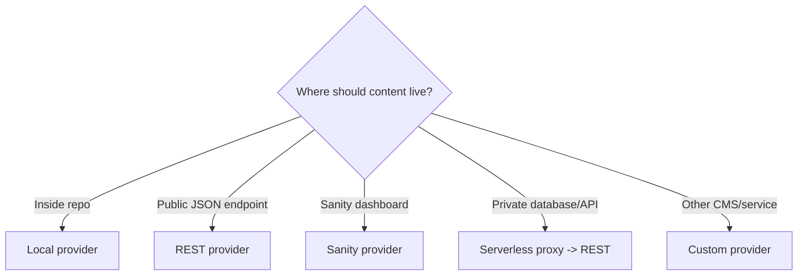
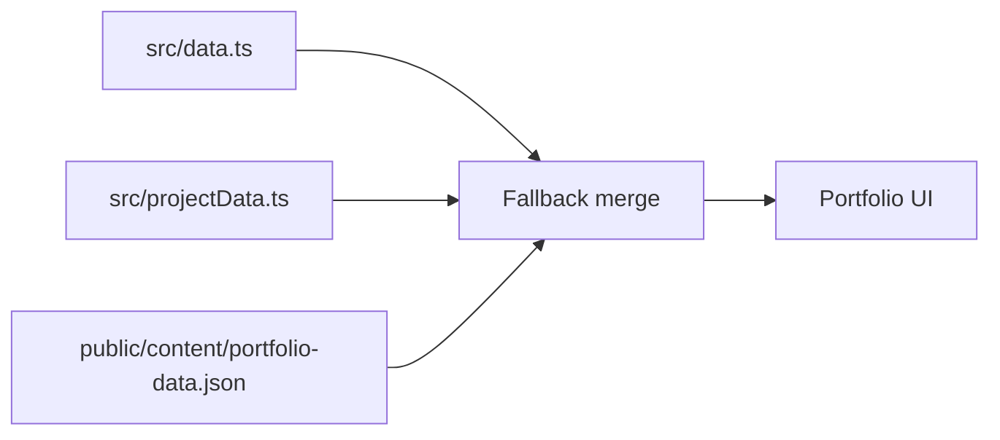
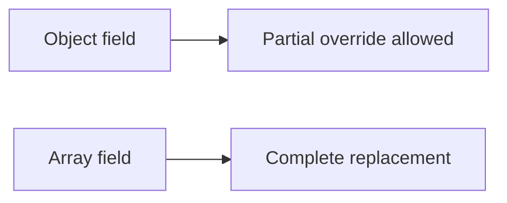
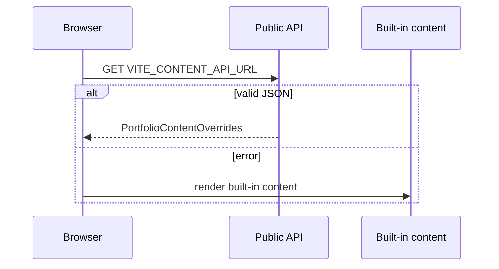
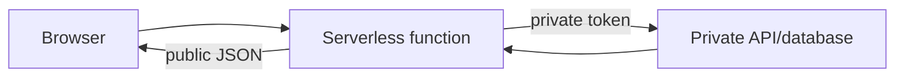
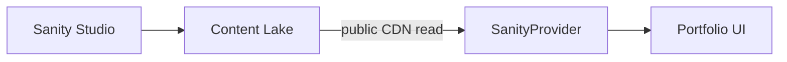
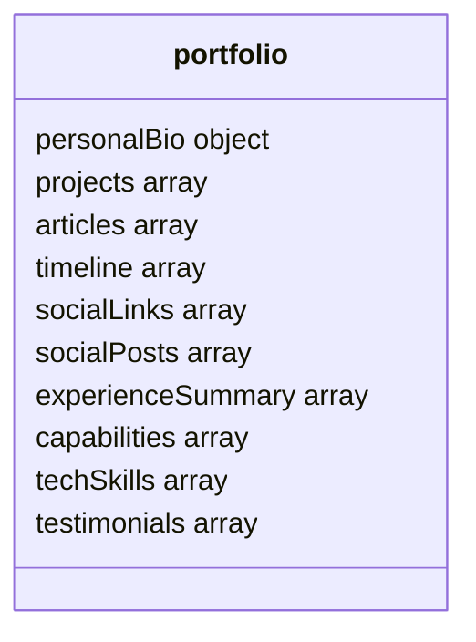
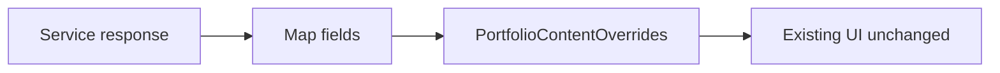
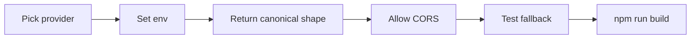

# Connect Content and Backends

## Provider Choice



## Environment Switch

```env
VITE_CONTENT_PROVIDER=local
```

| Provider | Extra env |
|---|---|
| `local` | None |
| `rest` | `VITE_CONTENT_API_URL` |
| `sanity` | `VITE_SANITY_PROJECT_ID`, `VITE_SANITY_DATASET`, `VITE_SANITY_API_VERSION` |
| `custom` | Add only public browser-safe values |

## Local Flow



| Task | File |
|---|---|
| Main portfolio text | `src/data.ts` |
| PDF-backed projects | `src/projectData.ts` |
| Small override | `public/content/portfolio-data.json` |
| Images | `public/images/` |
| Documents | `public/documents/` |

Array rule:



## REST Flow



```env
VITE_CONTENT_PROVIDER=rest
VITE_CONTENT_API_URL=https://api.example.com/portfolio
```

| Requirement | Value |
|---|---|
| Method | `GET` |
| Response | `application/json` |
| CORS | Allow portfolio origin |
| Auth | None in browser |
| Shape | `PortfolioContentOverrides` |
| Production | HTTPS |

## Private API Pattern



Never expose private tokens through `VITE_*`.

## Sanity Flow



```env
VITE_CONTENT_PROVIDER=sanity
VITE_SANITY_PROJECT_ID=your_project_id
VITE_SANITY_DATASET=production
VITE_SANITY_API_VERSION=2025-02-19
```



| UI value | Sanity field |
|---|---|
| Profile image | `personalBio.avatarUrl` or `personalBio.avatar` |
| Project image | `project.imageUrl` or `project.image` |
| Testimonial image | `testimonial.avatarUrl` or `testimonial.avatar` |
| Article body | `content` |

## Custom Provider



Touch points:

| Step | File |
|---|---|
| Add provider class | `src/content/providers.ts` |
| Register factory case | `createContentProvider()` |
| Add env typing | `src/vite-env.d.ts` |
| Keep UI unchanged | `src/components/` |

## Connection Checklist



## Troubleshooting

| Symptom | Check |
|---|---|
| Built-in content appears | Provider env + browser console |
| REST blocked | CORS header |
| Sanity empty | Published `_type: portfolio` document |
| Images missing | URL/path validity |
| Section empty | Remote array may be `[]` |
| Env ignored | Restart Vite or redeploy |
