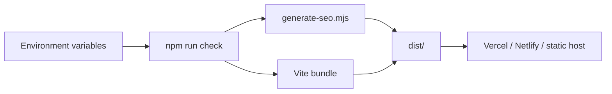
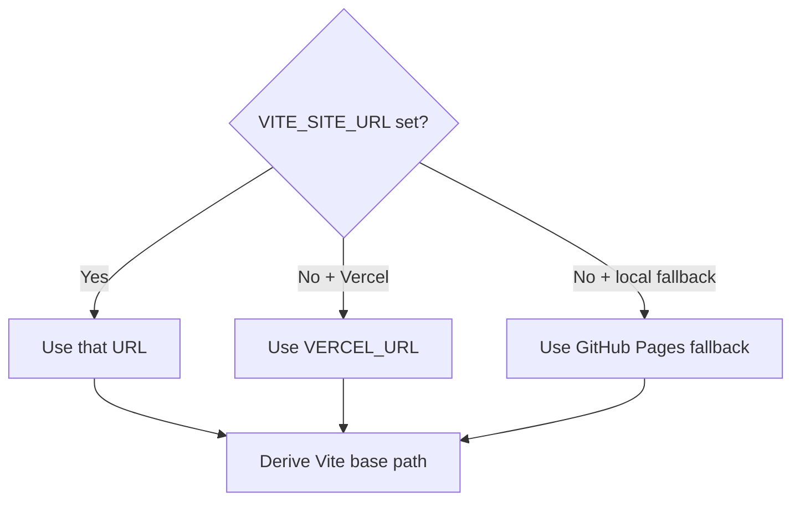
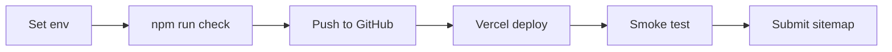

# Deployment

## Build Flow



## Platform Matrix

| Host | Build | Output | Config |
|---|---|---|---|
| Vercel | `npm run build` | `dist` | `vercel.json` |
| Netlify | `npm run build` | `dist` | `netlify.toml` |
| GitHub Pages | `npm run build` | `dist` | `VITE_SITE_URL` with repo path |

## Vercel Path Logic



This prevents root Vercel deploys from loading assets from `/portfoionew/assets/...`.

## Minimum Env

```env
VITE_CONTENT_PROVIDER=local
VITE_GOOGLE_FORM_ACTION_URL=https://docs.google.com/forms/d/e/.../formResponse
VITE_GOOGLE_FORM_FIRST_NAME_ENTRY=entry.xxxxx
VITE_GOOGLE_FORM_LAST_NAME_ENTRY=entry.xxxxx
VITE_GOOGLE_FORM_EMAIL_ENTRY=entry.xxxxx
VITE_GOOGLE_FORM_SUBJECT_ENTRY=entry.xxxxx
VITE_GOOGLE_FORM_MESSAGE_ENTRY=entry.xxxxx
```

Optional:

| Variable | Use when |
|---|---|
| `VITE_SITE_URL` | Final custom/canonical domain is known |
| `VITE_GA_MEASUREMENT_ID` | GA4 is enabled |
| `VITE_CONTENT_API_URL` | REST provider is selected |
| Sanity vars | Sanity provider is selected |

## Deploy Checklist



```text
[ ] Node.js 20+
[ ] npm ci
[ ] npm run check
[ ] Test /projects/:id
[ ] Test /articles/:slug
[ ] Test PDFs and resume
[ ] Test contact form -> Google Sheet
[ ] Submit /sitemap.xml after final domain
```

## Content Update Matrix

| Changed source | Rebuild? |
|---|---:|
| `src/data.ts` | Yes |
| `src/projectData.ts` | Yes |
| `public/` assets | Yes |
| REST API data | No |
| Sanity content | No |

## GitHub Pages Only

```env
VITE_SITE_URL=https://username.github.io/repository-name
```

```mermaid
flowchart LR
  URL[Production URL] --> Path[/repository-name]
  Path --> Base[Vite base path]
  Base --> Assets[/repository-name/assets/...]
```
