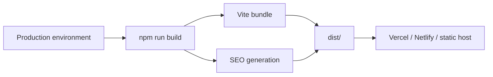
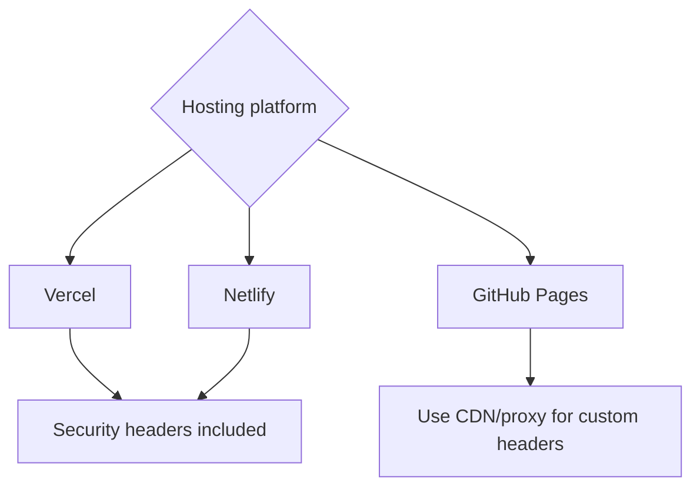

# Deployment

## Build flow



## Required production value

```env
VITE_SITE_URL=https://your-domain.com
```

Add only the variables required by the selected content provider.

## Platform matrix

| Platform | Build command | Output | Routing/security config |
|---|---|---|---|
| Vercel | `npm run build` | `dist` | `vercel.json` |
| Netlify | `npm run build` | `dist` | `netlify.toml` |
| GitHub Pages | `npm run build` | `dist` | Generated routes + repository base path |



## Deployment checklist

```text
[ ] Set VITE_SITE_URL
[ ] Set the selected content-provider variables
[ ] Set VITE_GA_MEASUREMENT_ID only if analytics is enabled
[ ] Run npm run lint
[ ] Run npm run build
[ ] Test /projects/:id directly
[ ] Test /articles/:slug directly
[ ] Submit /sitemap.xml to Search Console
```

## Content update behavior

| Provider | Update requires rebuild? |
|---|---:|
| `src/data.ts` | Yes |
| `public/portfolio-data.json` | Yes after repository edit |
| REST API | No, unless response is deployment-cached |
| Sanity | No for runtime content |

Build-time sitemap routes come from `src/data.ts`. Remote-only projects and articles need a deployment-time sitemap integration for complete pre-rendering.

## GitHub Pages base path

For `https://username.github.io/repository-name/`, include the repository path in the production URL:

```env
VITE_SITE_URL=https://username.github.io/repository-name
```

The production Vite base is derived automatically from this URL. Local development continues to use `/`, while custom-domain and root deployments automatically keep the production base at `/`.
