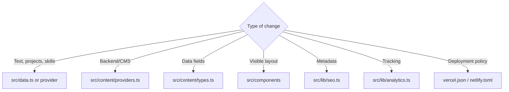

# Project Structure

## Directory map

```text
portfoionew/
├── public/
│   ├── portfolio-data.json    local content overrides
│   ├── favicon.svg
│   ├── robots.txt
│   └── sitemap.xml
├── scripts/
│   └── generate-seo.mjs       sitemap + direct route output
├── src/
│   ├── components/            visible UI only
│   ├── content/
│   │   ├── index.tsx          context entry point
│   │   ├── providers.ts       local + REST + Sanity
│   │   ├── defaults.ts        sanitize + fallback merge
│   │   └── types.ts           canonical content contract
│   ├── lib/
│   │   ├── analytics.ts       optional GA4
│   │   ├── routes.ts          project/article URLs
│   │   ├── security.ts        URL and input validation
│   │   └── seo.ts             metadata + JSON-LD
│   ├── App.tsx                composition + route state
│   ├── data.ts                complete built-in content
│   ├── index.css              global visual rules
│   └── main.tsx               application bootstrap
├── .env.example
├── index.html
├── netlify.toml
├── vercel.json
└── vite.config.ts
```

## Where should a change go?



## Simple path vs advanced path

| Need | Edit |
|---|---|
| Personal copy | `src/data.ts` |
| Small deployment override | `public/portfolio-data.json` |
| CMS/API | `.env.local` + `providers.ts` |
| New visual feature | `src/components/` |

## Design boundary

```text
content/ + lib/ + backend configuration
                 ↓ data only
components/ + index.css
                 ↓ presentation only
browser
```

Root deployment files stay at the root because hosting platforms discover them there.
