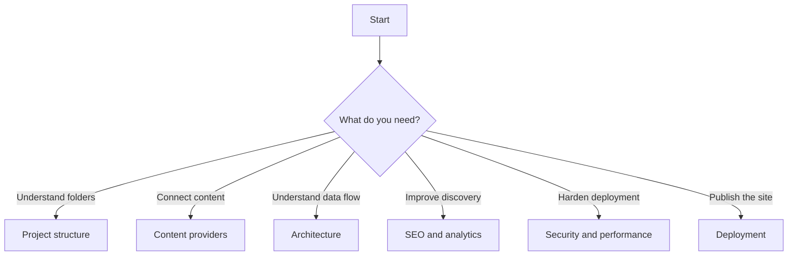
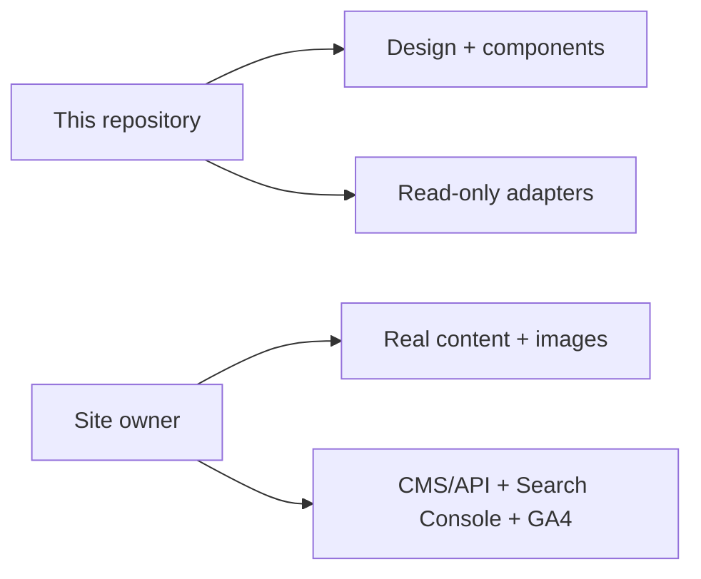

# Documentation Map



| # | Guide | Outcome |
|---:|---|---|
| 1 | [Project structure](PROJECT_STRUCTURE.md) | Know where changes belong |
| 2 | [Content providers](CONTENT_PROVIDERS.md) | Connect JSON, REST, or Sanity |
| 3 | [Content architecture](CONTENT_ARCHITECTURE.md) | Extend adapters safely |
| 4 | [SEO and analytics](SEO_AND_ANALYTICS.md) | Configure discovery and measurement |
| 5 | [Security and performance](SECURITY_AND_PERFORMANCE.md) | Deploy with safe defaults |
| 6 | [Deployment](DEPLOYMENT.md) | Configure and publish the build |

## Five-minute path

```text
1. npm install
2. cp .env.example .env.local
3. choose VITE_CONTENT_PROVIDER
4. npm run dev
5. replace placeholder content
```

## Ownership boundary


