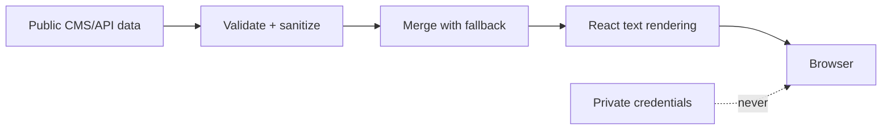
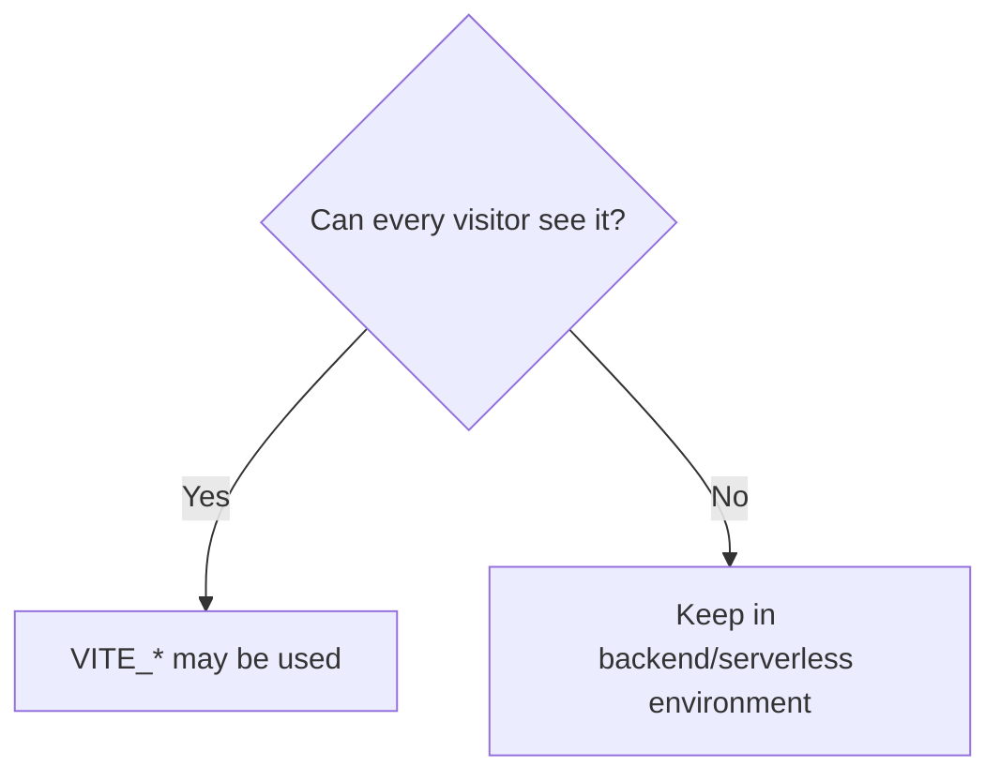
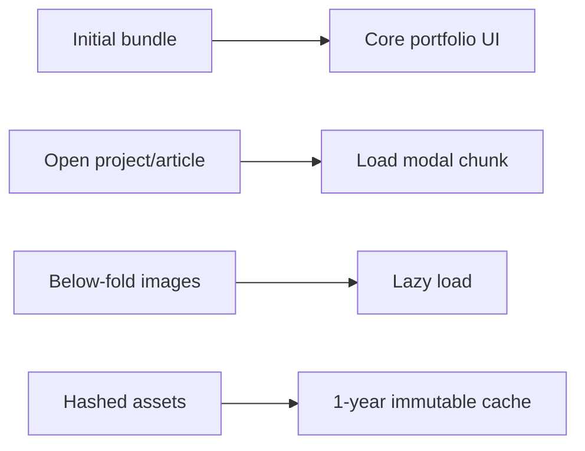

# Security and Performance

## Trust boundary



## Built-in controls

| Layer | Control |
|---|---|
| Provider config | REST URL + Sanity identifier validation |
| Remote content | URL and email sanitization |
| Rendering | No raw HTML injection |
| Browser | CSP, referrer, permissions, framing policies |
| External links | `noopener noreferrer` |
| Assets | Immutable caching for hashed files |
| Motion | Reduced-motion support |
| Bundle | Modals loaded on demand |

## Public vs private values



| Public frontend values | Private backend values |
|---|---|
| Site URL | Database password |
| GA4 measurement ID | CMS write token |
| Public REST endpoint | Personal access token |
| Sanity project/dataset | Private API key |

## Hosting headers

```text
Vercel  → vercel.json
Netlify → netlify.toml
GitHub Pages → configure headers through a CDN/proxy
```

Configured headers:

```text
Content-Security-Policy
Referrer-Policy
Permissions-Policy
X-Content-Type-Options
X-Frame-Options
Cross-Origin-Opener-Policy
```

The default CSP permits HTTPS images and connections for pluggable providers. A single-site deployment can restrict `img-src` and `connect-src` to its known services.

## Performance flow



## Maintenance

```bash
npm run lint
npm run build
npm audit
```

```text
[ ] Review dependency changelogs
[ ] Test direct content URLs
[ ] Check browser CSP errors
[ ] Run PageSpeed Insights
[ ] Avoid npm audit fix --force without review
```

Authentication, sessions, CSRF, write-rate limits, and database authorization belong to a user-supplied backend; this repository is a read-only frontend.
