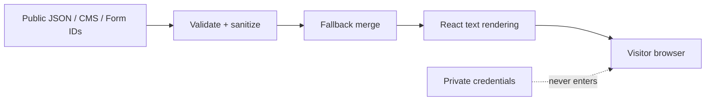
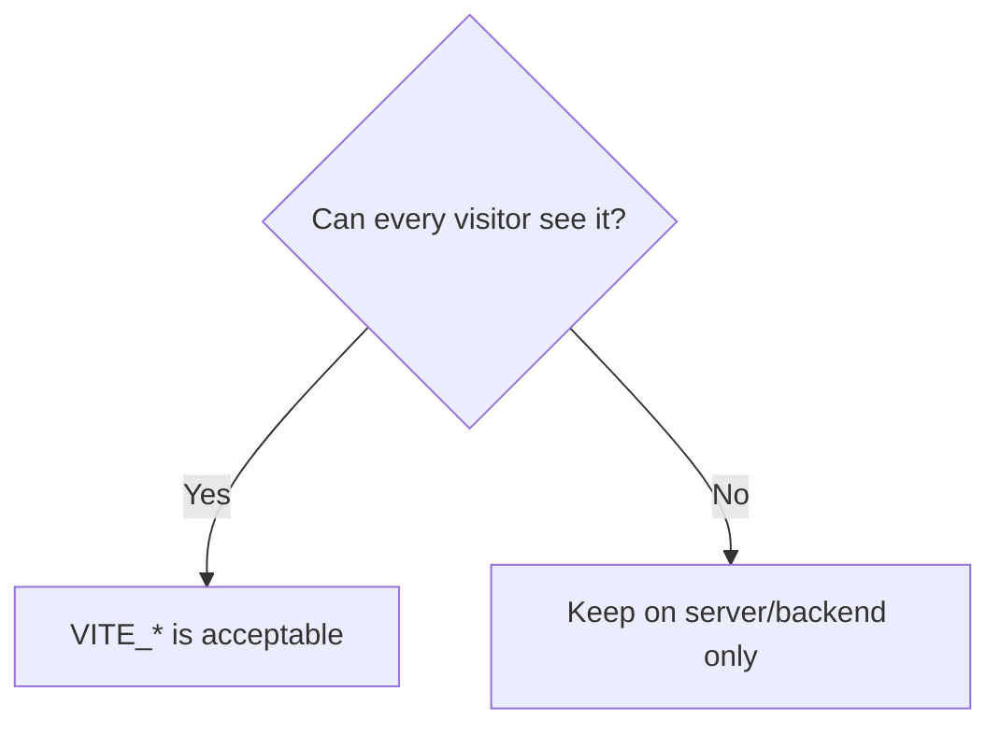
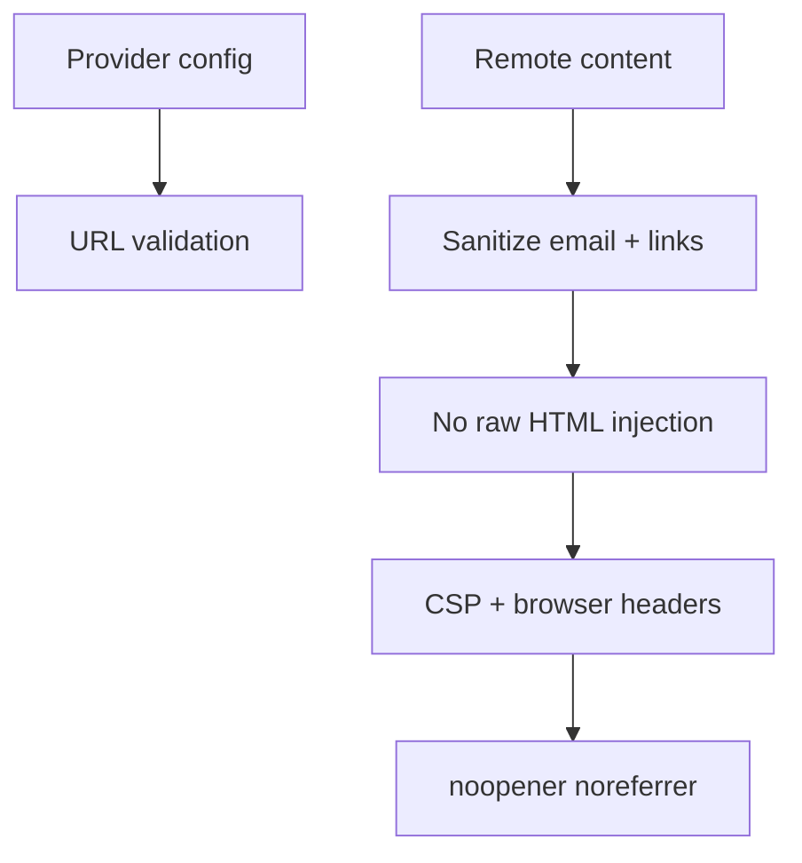
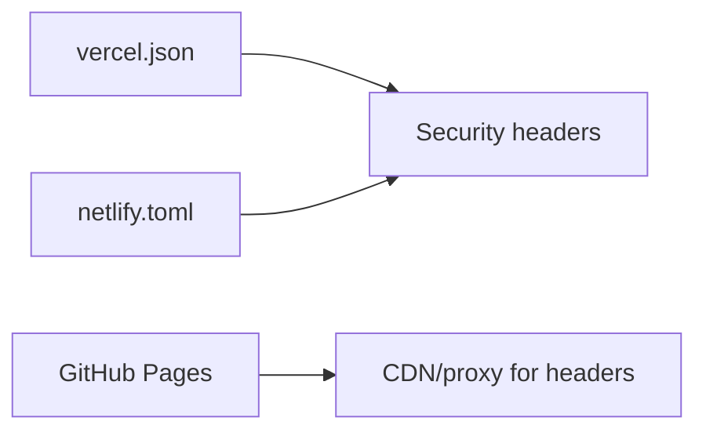
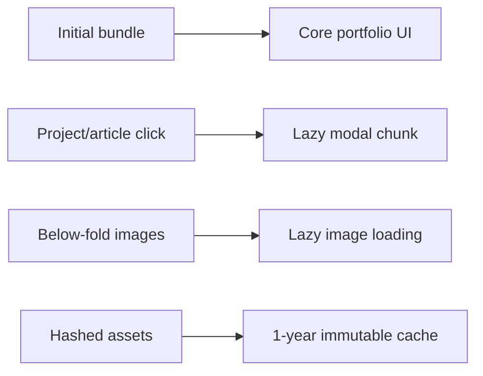
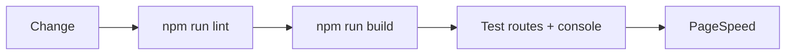

# Security and Performance

## Trust Boundary



## Public vs Private



| Public frontend values | Private backend values |
|---|---|
| Site URL | Database password |
| GA4 ID | CMS write token |
| Public REST endpoint | Personal access token |
| Sanity project/dataset | Private API key |
| Google Form ID + `entry.*` | Google password/OAuth secret |

## Controls Map



| Layer | Control |
|---|---|
| Config | REST/Sanity validation |
| Rendering | React text output, no raw HTML |
| Browser | CSP, referrer, permissions, frame policy |
| Links | `noopener noreferrer` |
| Assets | Hashed immutable cache |
| Motion | Reduced-motion support |
| Bundle | Modal chunks lazy-loaded |

## Hosting Headers



Configured:

```text
Content-Security-Policy
Referrer-Policy
Permissions-Policy
X-Content-Type-Options
X-Frame-Options
Cross-Origin-Opener-Policy
```

## Performance Shape



## Maintenance Loop



```text
[ ] Check CSP console errors
[ ] Test direct project/article routes
[ ] Test contact form delivery
[ ] Run PageSpeed after visual-heavy changes
[ ] Review dependency updates before npm audit fix --force
```

## Backend Boundary

Authentication, write-rate limits, CSRF, database authorization, private workflows, and verified email delivery belong behind a backend or serverless endpoint.
