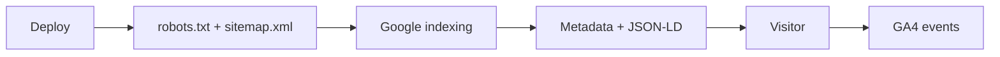
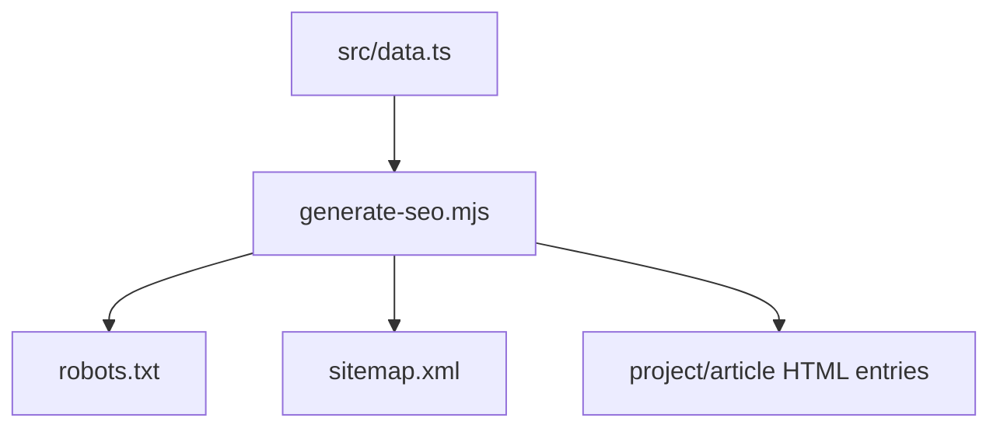
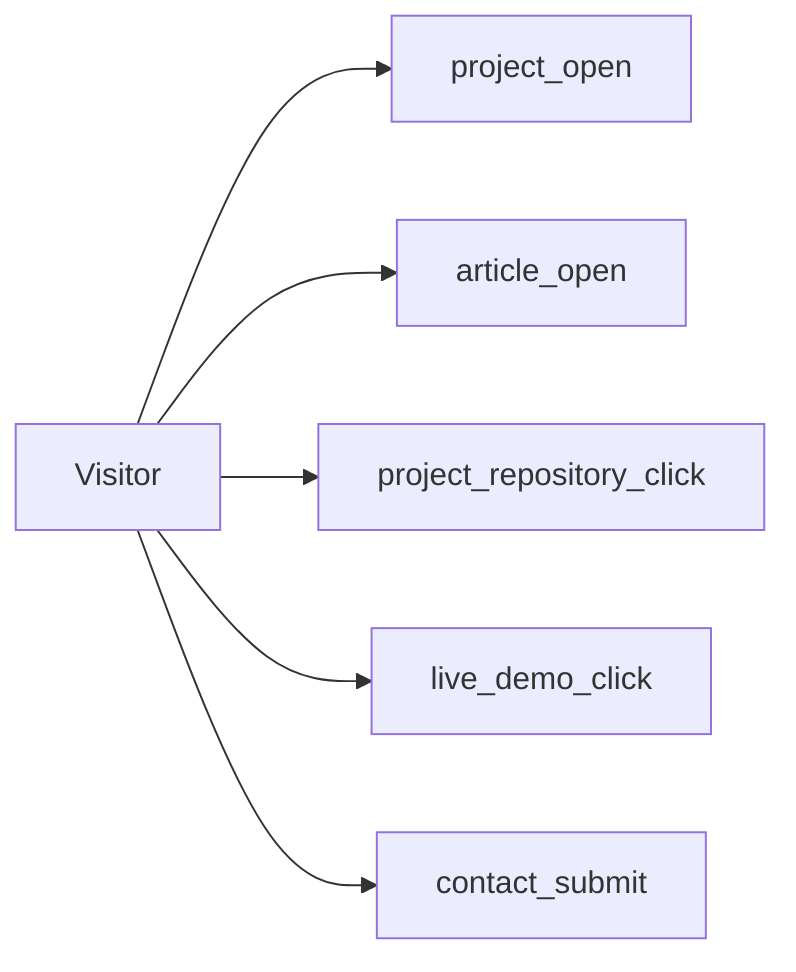

# SEO and Analytics

## Discovery pipeline



## Configure production

```env
VITE_SITE_URL=https://your-domain.com
VITE_GA_MEASUREMENT_ID=G-XXXXXXXXXX
```

GA4 is disabled when the measurement ID is empty.

## Automated by the repository

| Capability | Implementation |
|---|---|
| Titles and descriptions | `src/lib/seo.ts` |
| Canonical URLs | `src/lib/seo.ts` |
| Open Graph/Twitter cards | `src/lib/seo.ts` |
| JSON-LD | `ProfilePage`, `Person`, `WebSite`, `Article`, `CreativeWork` |
| Crawlable content URLs | `/projects/:id`, `/articles/:slug` |
| Sitemap and robots | `scripts/generate-seo.mjs` |
| Static route output | Route-specific title, description, canonical, social metadata, and JSON-LD during the build lifecycle |
| GA4 | `src/lib/analytics.ts` |



Remote-provider entries are not available to the build-time script. For fully pre-rendered remote content, fetch it during deployment or use an SSR/static-generation integration.

## Search Console checklist

```text
[ ] Deploy to the final HTTPS domain
[ ] Verify a Domain property
[ ] Submit /sitemap.xml
[ ] Inspect the homepage
[ ] Inspect one project URL
[ ] Inspect one article URL
[ ] Request indexing
[ ] Monitor indexing + Core Web Vitals
```

After each meaningful content release, inspect the new URL rather than repeatedly requesting the unchanged homepage. Sitemap submission is a discovery hint; indexing and rankings are not guaranteed.

## Organic reach priorities

```text
[ ] Publish first-hand engineering case studies with real constraints, decisions, code, and outcomes
[ ] Link every important article and project from at least one crawlable internal page
[ ] Add the portfolio URL to LinkedIn contact info, GitHub profile, and relevant project repositories
[ ] Use descriptive article and project titles written for the reader's actual search intent
[ ] Keep screenshots sharp, descriptive, and close to the text they explain
[ ] Update or remove content that is no longer accurate
```

Avoid meta-keyword tags, keyword stuffing, artificial backlink schemes, and filler written only to reach a word count.

## Analytics events



Additional automatic link events include `email_click`, `github_click`, `linkedin_click`, and `resume_download`.

## Validation

| Tool | Validate |
|---|---|
| Search Console URL Inspection | Crawling and indexing |
| Rich Results Test | Structured data |
| PageSpeed Insights | Mobile/desktop performance |
| GA4 DebugView | Events |
| Social preview validator | Open Graph image/text |

For Core Web Vitals, target LCP within 2.5 seconds, INP below 200 milliseconds, and CLS below 0.1 at the 75th percentile of real visits.

## Content credibility

```text
Use real screenshots
Use correct repository/demo links
Use verifiable achievements
Use genuine testimonials
Publish original case studies
```
