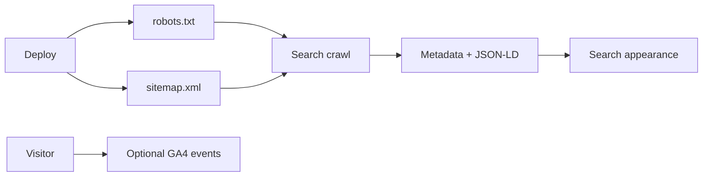
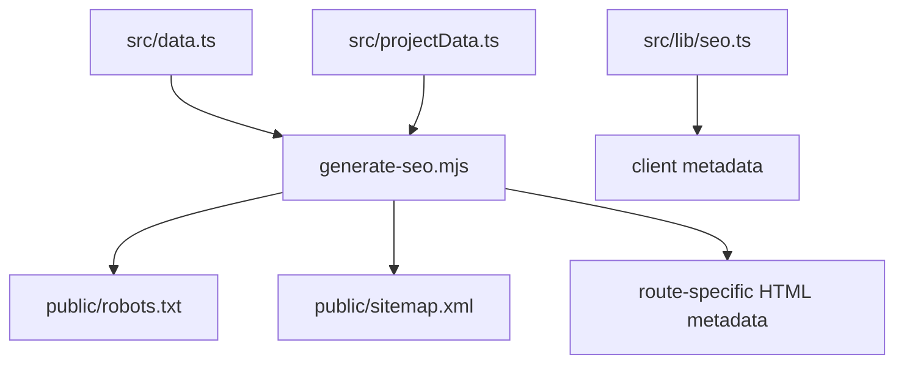
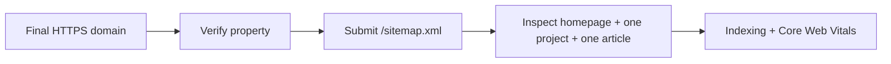
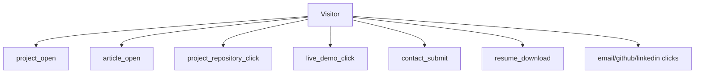
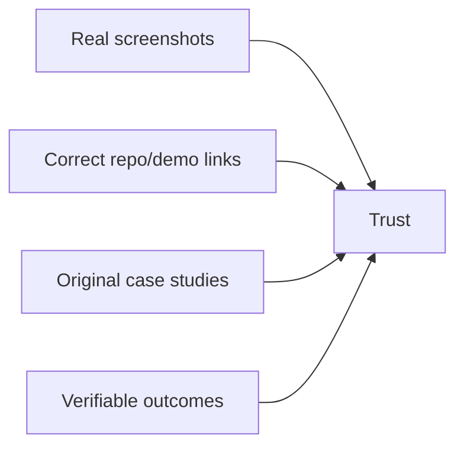

# SEO and Analytics

## Discovery Pipeline



## Generated Outputs



## Env

```env
VITE_SITE_URL=https://your-domain.com
VITE_GA_MEASUREMENT_ID=G-XXXXXXXXXX
```

| Value | Required? |
|---|---:|
| `VITE_SITE_URL` | Recommended for final canonical domain |
| `VITE_GA_MEASUREMENT_ID` | Only for GA4 |

GA4 stays disabled when the measurement ID is empty.

## SEO Feature Matrix

| Feature | File |
|---|---|
| Titles/descriptions | `src/lib/seo.ts` |
| Canonical URLs | `src/lib/seo.ts` |
| Open Graph/Twitter cards | `src/lib/seo.ts` |
| JSON-LD | `src/lib/seo.ts`, `scripts/generate-seo.mjs` |
| Sitemap/robots | `scripts/generate-seo.mjs` |
| Direct routes | `/projects/:id`, `/articles/:slug` |
| GA4 events | `src/lib/analytics.ts` |

## Search Console Flow



## Event Map



## Validation Matrix

| Tool | Checks |
|---|---|
| Search Console | Crawl/index status |
| Rich Results Test | Structured data |
| PageSpeed Insights | Core Web Vitals |
| GA4 DebugView | Events |
| Social preview tools | Card image/text |

Targets:

```text
LCP <= 2.5s
INP <= 200ms
CLS <= 0.1
```

## Content Credibility


